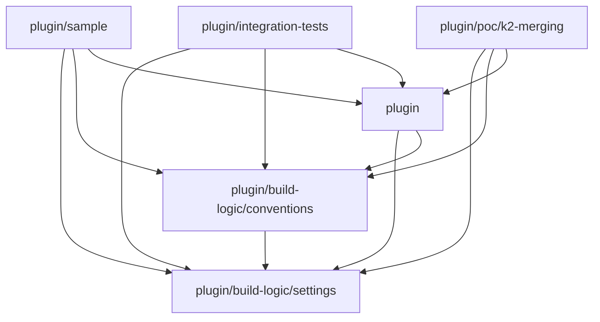

# multi-build-project-canary

```mermaid

flowchart TD
  
  build-logic.settings[plugin/build-logic/settings]
  build-logic.conventions[plugin/build-logic/conventions]
  
  plugin[plugin]
  
  sample[plugin/sample]
  integration-tests[plugin/integration-tests]
  
  poc.k2-merging[plugin/poc/k2-merging]

  build-logic.conventions --> build-logic.settings

  plugin --> build-logic.settings
  plugin --> build-logic.conventions
  
  sample --> build-logic.settings
  sample --> build-logic.conventions
  sample --> plugin
  
  integration-tests --> build-logic.settings
  integration-tests --> build-logic.conventions
  integration-tests --> plugin
  
  poc.k2-merging --> build-logic.settings
  poc.k2-merging --> build-logic.conventions
  poc.k2-merging --> plugin
  

```
